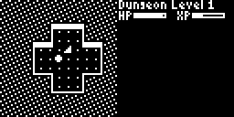
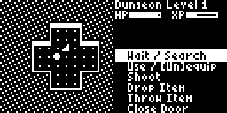
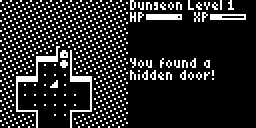

# ArduRogue

ArduRogue is a traditional roguelike for the [Arduboy](https://www.arduboy.com/).

## Introduction

This is you: 

## Monsters

In roughly increasing difficulty:

| Symbol                   | Name        | Notes |
| ------------------------ | ----------- | ----- |
|          | bat         | non-aggressive, fast, cannot open doors |
|        | snake       | slow, cannot open doors |
|  | rattlesnake | slow, poisonous, cannot open doors |
|       | zombie      | slow |
|       | goblin      | |
|          | orc         | |
|    | hobgoblin   | |
|        | mimic       | looks exactly like a closed door, stays still until attacked | 
|        | troll       | slow, regenerates health |
|      | griffin     | fast, cannot open doors |
|       | dragon      | cannot open doors |

## Items

### Potions

Symbol: 

### Scrolls

Symbol: 

### Rings

Symbol: 

You are able to wear one ring at a time.

### Amulets

Symbol: 

## Effects

## Tips

### Use Doors to Escape

Not all monsters are able to open doors (as a rule, only humanoid monsters can).
Use this to your advantage by closing a door behind you to block off a dangerous monster's pursuit.
Note that you will need to have some distance, as you cannot close a door while the monster is standing in the doorframe.

### Hidden Doors

If you're stuck in a room with no doors, or can't find the staircase to the next dungeon, try searching for hidden doors.

Press B to bring up the action menu.

Select "Wait / Search". This action spends a turn doing nothing, but will search all adjacent squares for secrets.
Then walk next to the walls of the room and press A while standing next to each section of wall (pressing A will repeat the previously selected action).

## TODO

- Wands
  - Striking (simple single-target damage)
  - Force (pushes monsters back)
  - Fire (area of effect damage)
  - Lightning (arcs between monsters)
  - Teleportation (teleports target)
  - Frenzy (target attacks any nearest entity)
- Floor traps
- Dragon breathes fire
- Allow wearing up to two rings
- Different map types (cave style?)
- High Score List
